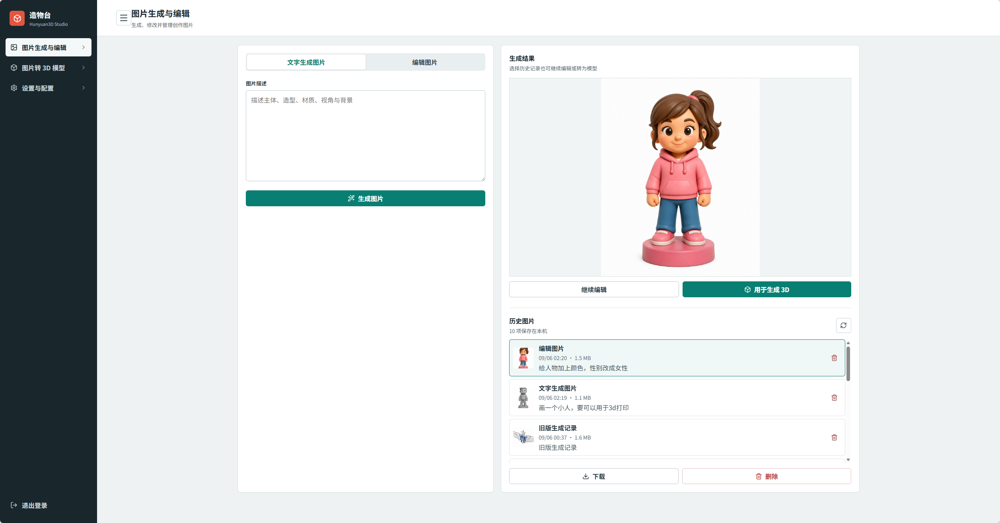
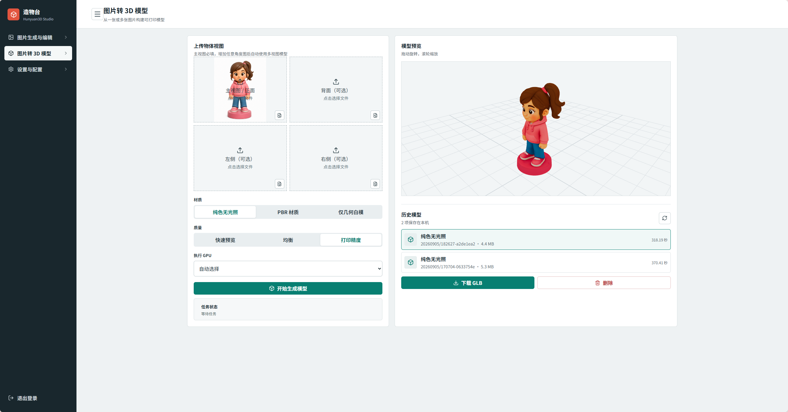
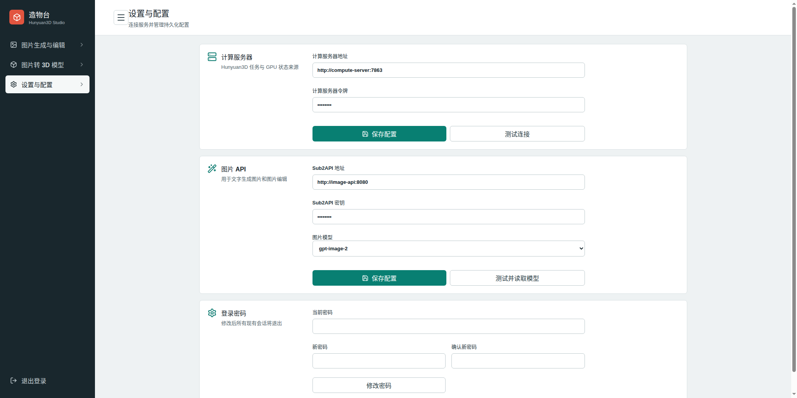

# Hunyuan3D Studio

一个整合图片生成/编辑、Hunyuan3D-2.1 图片转 3D、GLB 预览与历史管理的局域网工作台。

## 仓库结构

```text
web/       Vue/FastAPI Web 应用、Dockerfile 和群晖 Compose
compute/   应用到 Hunyuan3D-2.1 上游源码的计算服务覆盖层
docs/      架构、部署、迁移和运维文档
```

Web 与计算端在同一 `main` 分支共同版本化，以保证 API 契约一致；它们不是互相替代的版本，因此不使用两个长期分支。

## 组件

- Vue 3 + Vite + Three.js 前端
- FastAPI Web 服务（7864）
- 独立 Compute API（7863）
- 按需加载的 Hunyuan3D 单图和多视图后端
- Sub2API 兼容的图片生成与编辑接口

Web 保存配置、图片和 GLB；GPU 服务器仅负责串行计算及临时文件。支持 PBR、纯色无光照和白模 GLB，自动/手动选 GPU，并在空闲后卸载模型释放显存。

## 界面展示

### 图片生成与编辑



### 图片转 3D 模型



### 设置与配置



## 运行 Web

```bash
cd web/web-src
npm ci
npm run build
cd ../..
python -m pip install -r web/requirements-local.txt
HUNYUAN_INITIAL_PASSWORD='请设置强密码' ./web/start-local-web.sh
```

访问 `http://localhost:7864/login`，登录后在设置页填写 Compute API 和图片 API 地址及密钥。

Docker：

```bash
docker build -t hunyuan3d-web:latest ./web
docker run -d --name hunyuan3d-web \
  -p 7864:7864 \
  -v /path/to/persistent-data:/data \
  -e HUNYUAN_INITIAL_PASSWORD='请设置强密码' \
  -e HUNYUAN_WEB_DATA_DIR=/data \
  --restart unless-stopped \
  hunyuan3d-web:latest
```

不要将服务直接暴露到公网。真实密钥、密码和生成文件不得提交到 Git。

## 文档

- [开发与维护记录](docs/DEVELOPMENT_RECORD.md)：架构、功能、进度和维护原则
- [群晖部署](docs/SYNOLOGY_DEPLOYMENT.md)：Container Manager 部署
- [计算服务器部署](docs/COMPUTE_SERVER_DEPLOYMENT.md)：持久目录与运行方式
- [计算容器重建](docs/PORTAINER_COMPUTE_REBUILD.md)：Portainer 重建及手动恢复
- [Compute Overlay (English)](compute/README.md)：计算端覆盖层发布说明

Hunyuan3D 模型本体及其许可请以上游 Tencent Hunyuan3D-2.1 项目为准。
